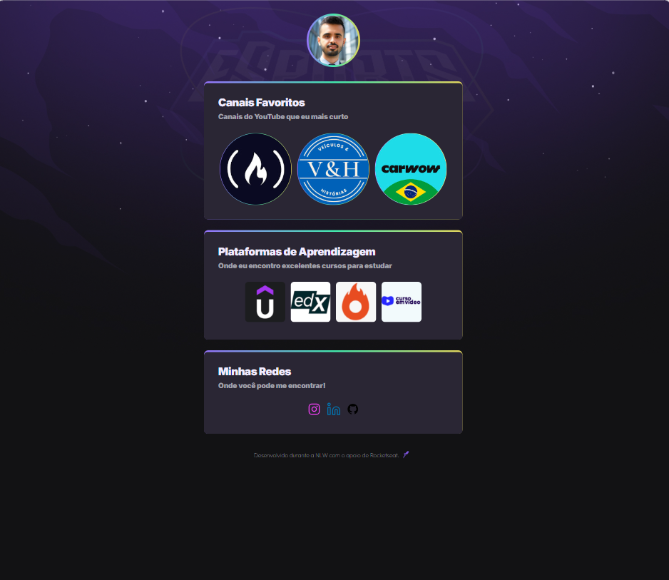

# NLW eSports - Trilha Explorer

>Projeto construído do evento Newt Level Week da Rocketseat.

🔗 [Clique para acessar](https://lucasfnandos.github.io/NLW/)

## 💻Tecnologias 

- HTML
- CSS
- Git e GitHub

## 📧Contato

lucasfsoares@hotmail.com

#### Esta é a minha adaptação do projeto que foi ensinado durante a NLW da Rocketseat que tinha como tema o mundo dos eSports. Eu adaptei conforme minha realidade de navegação e fiquei muito feliz com o resultado. Continuarei estudando e aplicando tecnologias para desenvolver páginas ainda mais legais. 🚀